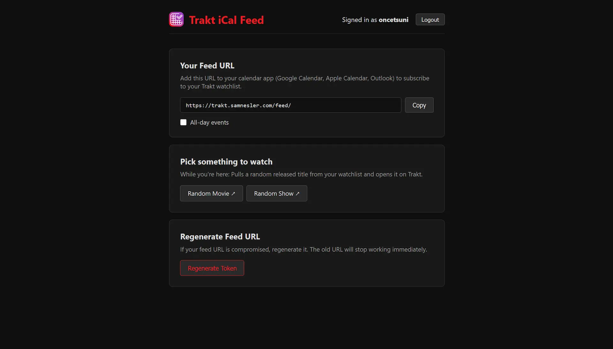

<div align="center">

</div>

# Trakt iCal Feed

https://trakt.samnesler.com

Subscribe to your Trakt watchlist as a calendar feed. See air dates for shows and release dates for movies, right in your calendar app.

- Watchlist Calendar: Upcoming episodes and movie releases from your Trakt watchlist, delivered as a standard iCal feed.
- Works Everywhere: Google Calendar, Apple Calendar, Outlook — any app that supports URL subscriptions.
- Always Fresh: Your calendar updates automatically as your watchlist changes. No manual syncing needed.



## Running your own instance

The app runs as a Cloudflare Worker and depends on Cloudflare D1 and KV, so this isn't truly self-hostable — but you can deploy your own copy to your Cloudflare account.

### Prerequisites

- A [Cloudflare](https://dash.cloudflare.com/) account
- [Node.js](https://nodejs.org/) and [pnpm](https://pnpm.io/)
- [Wrangler](https://developers.cloudflare.com/workers/wrangler/) (installed via `pnpm install`)

### 1. Create a Trakt API application

1. Go to [trakt.tv/oauth/applications](https://trakt.tv/oauth/applications) and create a new application.
2. Set the redirect URI to `https://<your-worker-domain>/auth/callback` (you can come back and update this once you know the deployed URL).
3. Save the **Client ID** and **Client Secret** for later.

### 2. Clone and install

```sh
git clone https://github.com/the-snesler/trakt-ical-feed.git
cd trakt-ical-feed
pnpm install
```

### 3. Create Cloudflare resources

Create a D1 database and a KV namespace for sessions:

```sh
pnpm wrangler d1 create trakt-ical-db
pnpm wrangler kv namespace create SESSIONS
```

Copy the printed `database_id` and KV `id` into `wrangler.jsonc`, replacing the values under `d1_databases` and `kv_namespaces` (and under `env.prod` if you plan to use that environment). You'll also want to change the `name` and remove or update the `routes` block under `env.prod` to point at your own domain (or delete the `env.prod` block entirely if you're just deploying to the default `*.workers.dev` URL).

Apply the database schema:

```sh
pnpm wrangler d1 execute trakt-ical-db --remote --file=./src/db/schema.sql
```

### 4. Configure secrets

The worker needs three secrets:

- `TRAKT_CLIENT_ID` — from your Trakt application
- `TRAKT_CLIENT_SECRET` — from your Trakt application
- `ENCRYPTION_KEY` — a random string used to encrypt stored OAuth tokens (e.g. `openssl rand -base64 32`)

Set them with Wrangler:

```sh
pnpm wrangler secret put TRAKT_CLIENT_ID
pnpm wrangler secret put TRAKT_CLIENT_SECRET
pnpm wrangler secret put ENCRYPTION_KEY
```

For local development, create a `.dev.vars` file in the project root with the same keys:

```
TRAKT_CLIENT_ID=...
TRAKT_CLIENT_SECRET=...
ENCRYPTION_KEY=...
```

### 5. Run locally or deploy

```sh
pnpm dev      # local dev server
pnpm deploy   # deploy to Cloudflare
```

Once deployed, make sure the redirect URI on your Trakt application matches the live worker URL.
